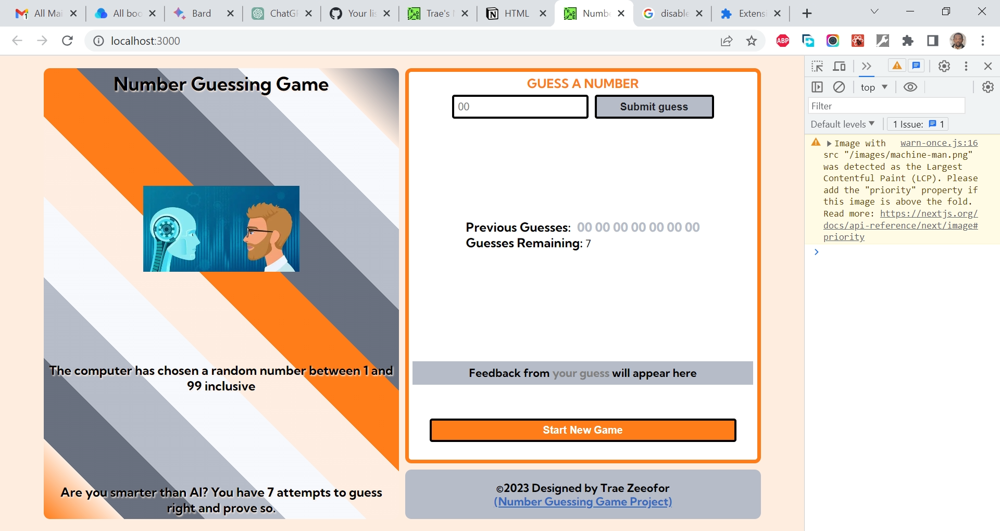

# Jsbeginners.com - Javascript Number Guessing Game Project

This is a solution to the [Javascript Number Guessing Game Project](https://jsbeginners.com/javascript-number-guessing-game/). I am trying to improve my coding skills by building realistic projects. 

## Table of contents

- [Overview](#overview)
  - [The challenge](#the-challenge)
  - [Screenshot](#screenshot)
  - [Links](#links)
- [My process](#my-process)
  - [Built with](#built-with)
  - [What I learned](#what-i-learned)
  - [Continued development](#continued-development)
  - [Useful resources](#useful-resources)
- [Author](#author)
- [Acknowledgments](#acknowledgments)

## Overview

### The challenge

- This objective is to code a game where the user must guess a randomly generated number from 1 to 100. 

### Screenshot

### Links

- Solution URL: [https://github.com/traez/number-guessing-game-project](https://github.com/traez/number-guessing-game-project)
- Live Site URL: [https://number-guessing-game-project-traez.vercel.app](https://number-guessing-game-project-traez.vercel.app)

## My process

### Built with

- Semantic HTML5 markup
- CSS custom properties
- Flexbox
- CSS Grid
- Mobile-first workflow
- [React](https://reactjs.org/) - JS library
- [Next.js](https://nextjs.org/) - React framework

### What I learned

1. This was a remake of an earlier project done in Vanilla Javascript. I got to resolve a "game over and restart" bug unsolved from past version.  
2. I got to better understand prop drilling and useEffect in Next.js.  
3. And i got to perfect my Media Queries setup skills.   

### Continued development

More Next.js projects. GraphQL projects too in the longer term.

### Useful resources

Stackoverflow  
YouTube  
Google  
ChatGPT  

## Author

- Website - [Trae Zeeofor](https://github.com/traez)  
- Twitter - [@trae_z](https://twitter.com/trae_z) 

## Acknowledgments

CKC 99 and SJS 99 Kings. Thanks for the banter.
